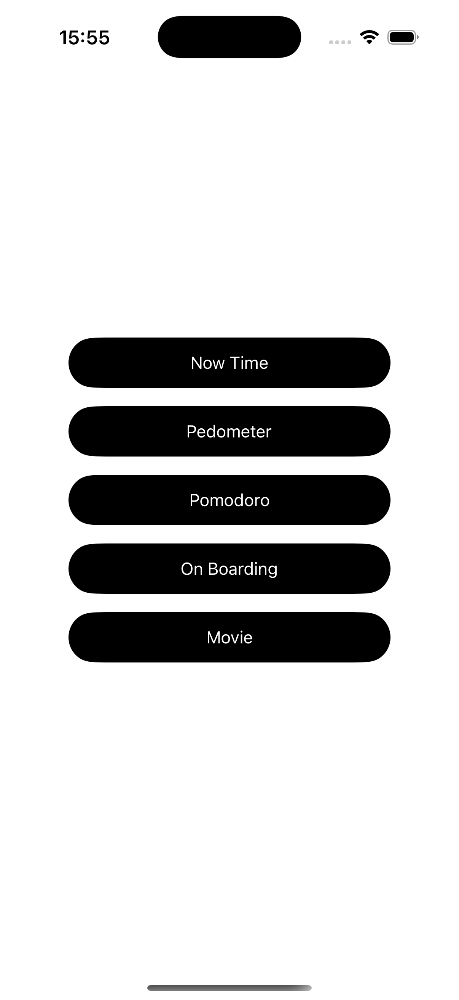
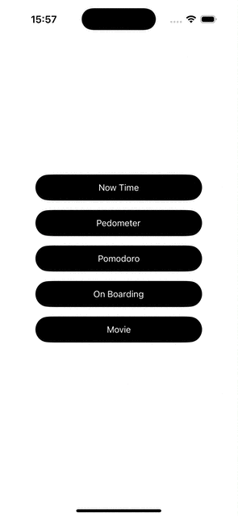

# 📱 iOS Training App

### 🏠 Màn hình chính
- Danh sách các button để điều hướng đến các màn hình.

### ⏰ TimeNow
- Hiển thị thời gian hiện tại.
- Nút `Step`: Ghi lại thời điểm hiện tại.
- Nút `Reset`: Xoá kết quả hiển thị.

### 🏃‍♂️ Pedometer
- Đồng hồ bấm giờ (stopwatch).
- `Start/Stop`: Bắt đầu hoặc dừng thời gian.
- `Step`: Ghi lại thời điểm hiện tại.
- `Reset`: Đặt lại đồng hồ.

### 🍅 Pomodoro
- Đồng hồ đếm ngược (mặc định 25 phút).
- `Start/Stop`: Bắt đầu hoặc dừng đếm.
- `Reset`: Quay về thời gian ban đầu.

### 📘 Onboarding
- Màn hình giới thiệu đơn giản.

### 🎞️ Movie
- `Danh sách phim`: Hiển thị danh sách phim từ API.
- `Chi tiết phim`: Hiển thị nội dung chi tiết của phim khi chọn.

---

## 🛠 Công nghệ sử dụng

- Swift + UIKit
- Auto Layout
- Timer / CADisplayLink
- Navigation Controller
- Optional: URLSession, async/await, MVVM, Combine, ...

---
